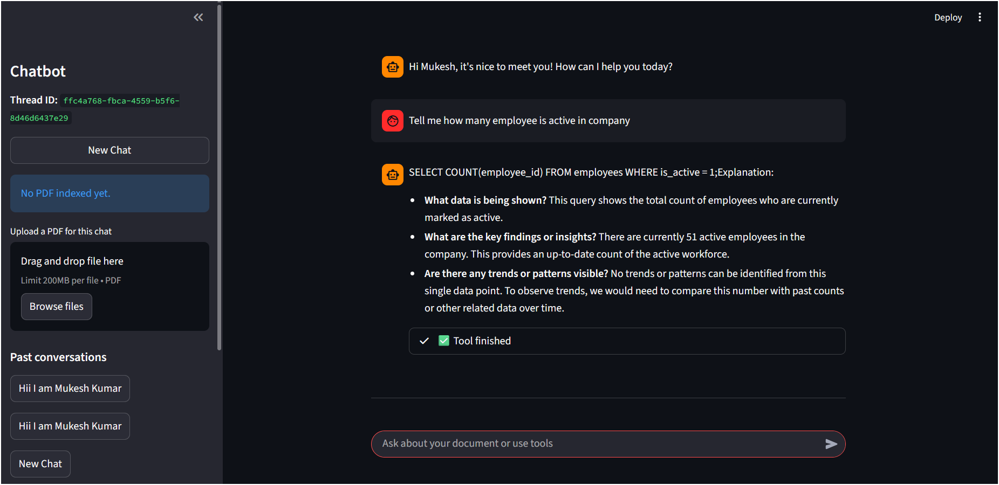
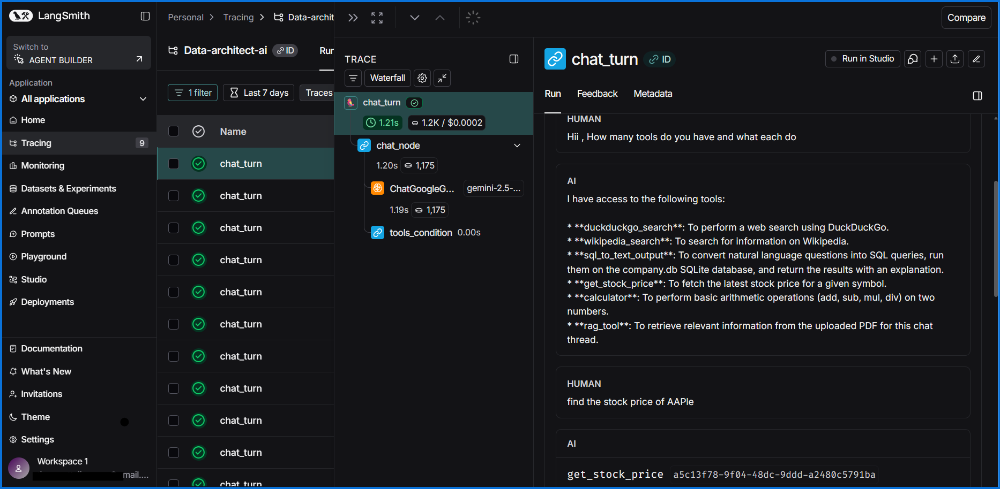

# Multi-Agent Enterprise Research Data Architect


> next


## 📖 Overview

The Multi-Agent Enterprise Research Data Architect is a sophisticated chatbot designed to streamline enterprise-level data research. It leverages a powerful multi-agent system built with LangGraph and Google's Gemini models to provide intelligent, context-aware responses to complex queries.

This application allows users to chat with an AI assistant that can access a variety of tools, including web search, a calculator, stock price lookups, and a SQL database interface. Its core feature is the ability to ingest and analyze PDF documents, enabling deep, document-specific Q&A through Retrieval-Augmented Generation (RAG).

The frontend is built with Streamlit, offering a clean and intuitive user interface for interacting with the AI, managing chat sessions, and uploading documents.

## ✨ Features

- **Conversational AI:** Engage in natural, context-aware conversations with a Gemini-powered AI.
- **Multi-Tool Agent:** The AI can autonomously use a suite of tools to answer questions:
    - **Web Search:** Access up-to-date information using DuckDuckGo and Wikipedia.
    - **Financial Data:** Get real-time stock prices.
    - **Calculations:** Perform mathematical calculations.
    - **Database Queries:** Interact with a SQL database.
- **Retrieval-Augmented Generation (RAG):**
    - Upload PDF documents for in-depth analysis.
    - The AI can read and understand the content of your documents to provide precise answers.
- **Chat Management:**
    - Conversations are organized into distinct threads.
    - View and revisit past conversations.
- **Persistent Memory:** Chat history is saved, allowing you to pick up where you left off.

## 🛠️ Technology Stack

- **Frontend:**
    - Streamlit
- **Backend:**
    - Python
- **AI & Machine Learning:**
    - **LLM:** Google Gemini 2.5 Flash Lite
    - **Embeddings:** Google Gemini Embedding 001
    - **Frameworks:** LangChain, LangGraph
    - **Vector Store:** FAISS (Facebook AI Similarity Search)
- **Database:**
    - SQLite (for chat history checkpointing)
- **Development & Tooling:**
    - Git

## 🚀 Getting Started

### Prerequisites

- Python 3.11
- An environment with the required packages installed.

### Installation

1.  **Clone the repository:**
    ```bash
    git clone https://github.com/Crashlar/Research-data-architect-ai.git
    cd Research-data-architect-ai
    ```

2.  **Create and activate a virtual environment:**
    ```bash
    python -m venv venv
    source venv/bin/activate  # On Windows, use `venv\Scripts\activate`
    ```

3.  **Install the dependencies:**
    ```bash
    pip install -r requirements.txt
    ```

4.  **Set up your environment variables:**
    - Create a `.env` file in the root directory.
    - Add your Google API key to the `.env` file:
      ```
      GOOGLE_API_KEY="your-google-api-key"
      ```

### Running the Application

1.  **Create the database (if needed):**
    ```bash
    python database/create_database.py
    ```

2.  **Launch the Streamlit app:**
    ```bash
    streamlit run streamlit_app.py
    ```

3.  Open your web browser and navigate to the URL provided by Streamlit (usually `http://localhost:8501`).

## 📜 License

This project is licensed under the MIT License. See the [LICENSE](LICENSE) file for details.

## ⚠️ Disclaimer

This software is provided "as is", without warranty of any kind, express or implied. The developers assume no liability for any damages or losses resulting from the use of this software. It is intended for educational and research purposes only.

## 📂 Project Structure

```
.
├── .gitignore
├── backend
│   ├── backend.py          # Core          LangGraph agent logic
│   └── my_tools
│       ├── builtintools.py   # DuckDuckGo, Wikipedia tools
│       ├── custom_tools.py   # Calculator, Stock Price tools
│       ├── databasetool.py   # SQL database tool
│       └── rag.py            # RAG implementation
├── database
│   ├── create_database.py  # Script to initialize the database
│   └── image.png           # Demo image
├── experiment.ipynb        # Jupyter notebook for experimentation
├── requirements.txt        # Project dependencies
├── streamlit_app.py        # Main Streamlit application
└── venv/                   # Virtual environment
```
